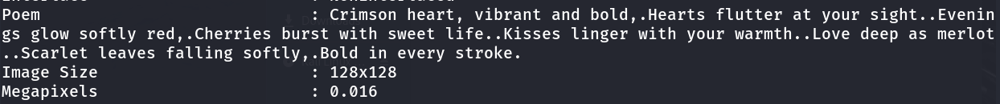
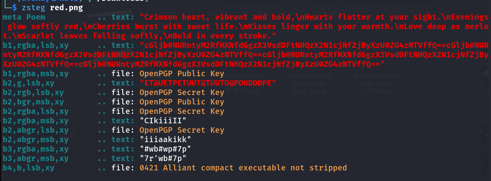

# Challenge: RED 

## Details

Source: picoCTF 2025

Category: Forensics

Difficulty: Easy

Given file: red.png

Date completed (dd.mm.yyyy): 07.07.2025


## Description

RED, RED, RED, RED


## Hints

1. The picture seems pure, but is it though?
2. Red?Ged?Bed?Aed?
3. Check whatever Facebook is called now


## Tools

- exiftool
- zsteg
- base64


## Steps taken

1. Analyze the metadata of the image:
 
    ```bash
    exiftool red.png
    ```

2. A poem found as a hint:

    

3. All hints suggested investigating RGBA channels.

4. Check for steganographic encoding in the least significant bits (LSB):

    ```bash
    zsteg red.png
    ```

The output:

    

5. The longest founding is a base64-encoded string.

6. Decode the base64-encoded string to get the flag.

    ```bash
    base64 -d <<< "cGljb0NURntyM2RfMXNfdGgzX3VsdDFtNHQzX2N1cjNfZjByXzU0ZG4zNTVffQ=="
    ```


## What I learned

1. exiftool - shows metadata (hidden info) inside images, videos, docs etc.

2. zsteg - detects LSB based steganography in images by scanning color channels.

    - LSB - Least Significant Bit is the rightmost bit. Changing it visually does not change the color noticeably, however it can hold hidden messages.

3. Base64 transforms binary data into a string of ASCII characters. Base64-encoded data can be identified by:

    - Usage of A-Z, a-z, 0-9, sometimes +/=
    - Ending in '=='

4. base64 command is used to encode a string, -d flag is used for decoding.

    ```bash 
    base64 <<< 'Hello, World!'
    SGVsbG8sIFdvcmxkIQo=
    base64 -d <<< SGVsbG8sIFdvcmxkIQo=
    'Hello, World!'
    ```


## Helpful references

1. [Base64 Encoding and Decoding of String](https://www.baeldung.com/linux/cli-base64-encode-decode)    
