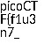
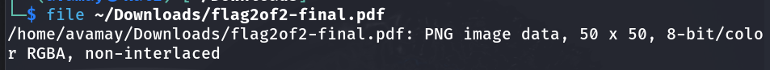
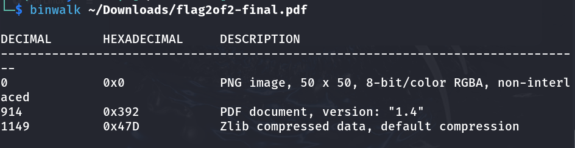

# Challenge: Secret of the Polyglot

## Details

- Source: picoCTF 2024
- Category: Forensics
- Difficulty: Easy
- Given file: flag2of2-final.pdf


## Description

The Network Operations Center (NOC) of your local institution picked up a suspicious file, they're getting conflicting information on what type of file it is. They've brought you in as an external expert to examine the file. Can you extract all the information from this strange file?


## Hints

This problem can be solved by just opening the file in different ways


## Tools

- file
- binwalk


## Steps taken

1. Firstly, I opened the pdf file, which seemed to contain some parts of the flag.

    

3. As hint suggested opening the file in different ways, I checked the file signature using file.

    

4. The file was a PNG file, therefore I converted it to png, which revelaed the first half of the flag

    

### Missteps (aka Tried but Failed)

- I used binwalk to analyze the file further and came across this:

    

- As far as I understood and searched, the file contains zlib-compressed data starting at byte 1149.

- I tried decompressing the file using a python script, however failed.

    ```bash
    dd if=flag2of2-final.png bs=1 skip=1149 of=compressed.zlib
    ```

     <pre> ```python3
        import zlib
        
        with open("compressed.zlib", "rb") as f:
            data = f.read()

        result = zlib.decompress(data)
        print(result.decode())
     ``` </pre>

The output was like this, which was already in the pdf file:

    


## What I learned

1. binwalk is used to analyze binary files for embedded files and executable code. It is mostly used to extract the content of firmware images.

2. It is a good practice to check the file signature first in CTF challenges.

3. zlib compressed files can often hide text, another file, encrypted or encoded payload. Decompressing them is not straightforward, as they cannot be decompressed with gzip.

4. If the given file extension turns out to be fake, it is a good idea to convert it back to its original extension.


## Helpful references

1. [CTF Handbook - Forensics](https://ctf101.org/forensics/what-are-file-formats/)

2. [Binwalk](https://cyberhub.sa/posts/3214)

3. [Python zlib](https://docs.python.org/3/library/zlib.html)
