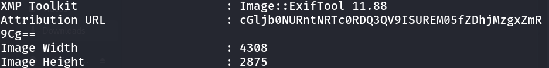

# Challenge: CanYouSee

## Details

- Source: picoCTF 2024
- Category: Forensics
- Difficulty: Easy
- Given file: unknown.zip
- Date Completed: 09.07.2025


## Description

How about some hide and seek?


## Hints

1. How can you view the information about the picture?
2. If something isn't in the expected form, maybe it deserves attention?


## Tools

- unzip
- binwalk
- exiftool


## Steps taken

1. I started by unzipping the file, using the command-line tool unzip.

    ```bash
    unzip unknown.zi
    ```

2. It revealed a jpg file called ukn-reality.jpg.

3. I used `binwalk` to ensure the file type. It was indeed a jpg/jpeg file.

4. I checked the metadata of the image, which revealed a base64-encoded string.

    

5. As I had already learned, I easily decoded the string and obtained the flag.

    ```bash
    base64 <<< cGljb0NURntNRTc0RDQ3QV9ISUREM05fZDhjMzgxZmR9Cg==
    ```


## What I learned

1. A command-line tool allows us to easily unzip. 
2. Revised `exiftool` and decoding with `base64`
