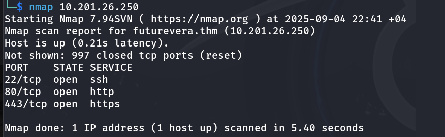
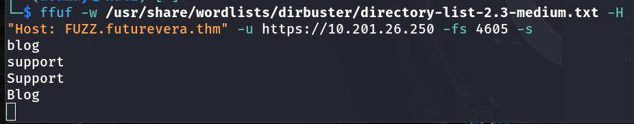
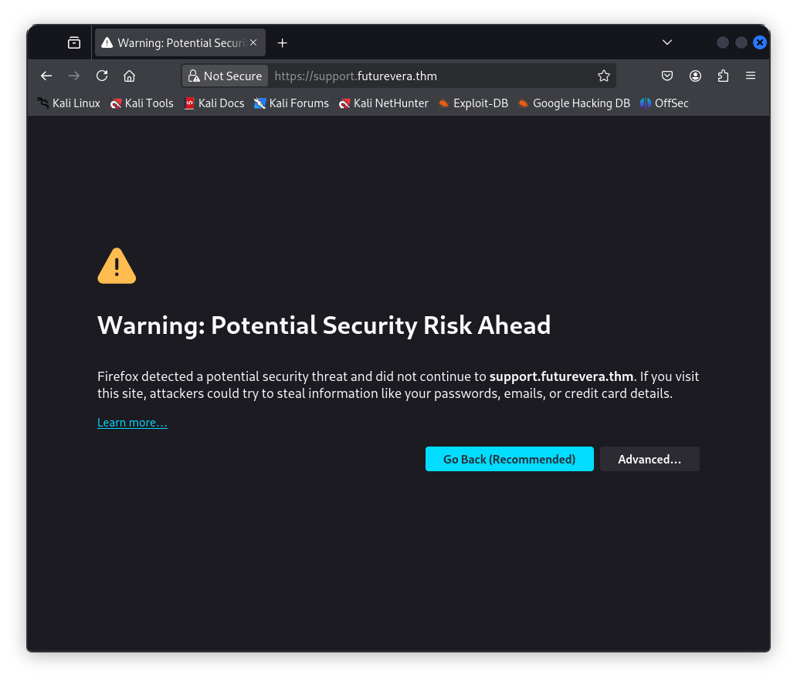
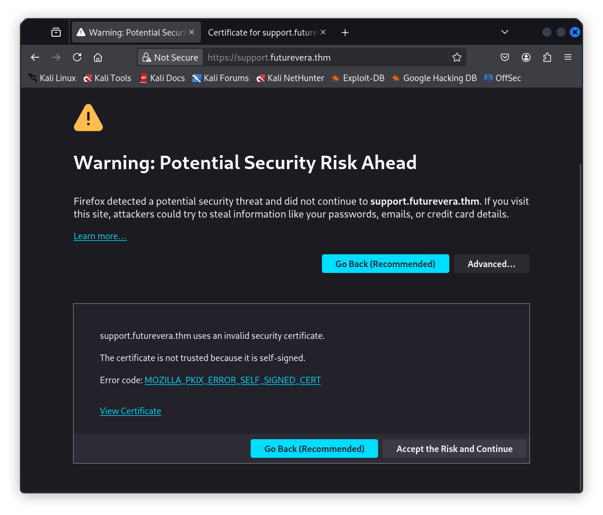
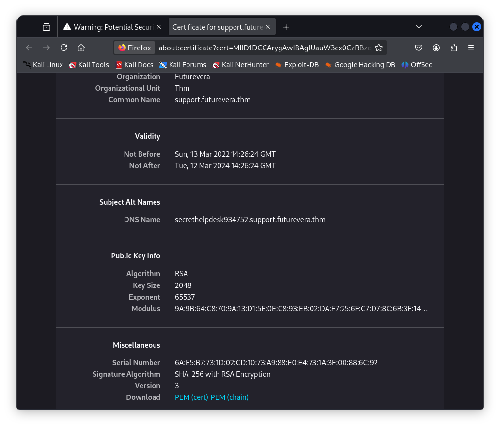
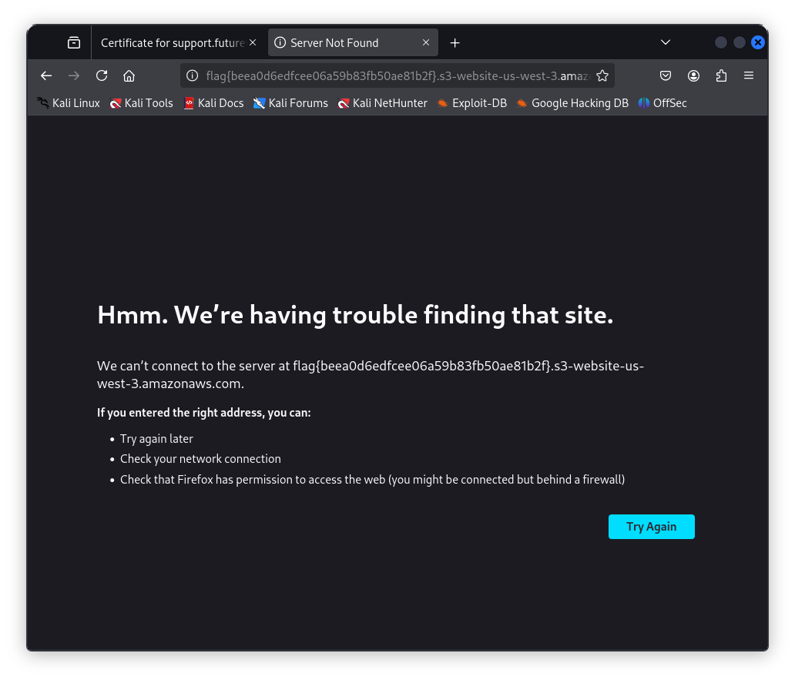

# Challenge: TakeOver

## Details

- Source: [TryHackMe](https://tryhackme.com/room/takeover)
- Category: Subdomain Enumeration
- Difficulty: Easy
- Date Completed: 04.09.2025

## Description

This challenge revolves around subdomain enumeration.

## Tools

- nmap
- ffuf

 ## Steps Taken

1. I started by adding the `Machine IP` to the `/etc/hosts` file.
   
2. I did a quick nmap analysis to see if I can find any useful open ports, although the challenge revolves around subdomain enumeration.

  

As expected, nmap result did not come in handy yet.

3. I tried passive reconnaissance with `subfinder`, however I could not find anything. Therefore, I decided to use `ffuf` to look for subdomains. It revealed 2 subdomains: `blog` and `support`.

  

4. I added them to the `/etc/hosts/` file and visited `https://support.futurevera.thm` subdomain.

   

5. I clicked `Advanced` and then viewed the certificate, which revealed another subdomain.

   

   

6. I added the new subdomain to the `/etc/hosts` and accessed the URL again, this time using port 80 - `http`. We can see the flag clearly.

   

## What I learned

1. It is important to use both active and passive reconnaissance.
2. `fuff` is a command line tool for active reconnaissance which can be used with the built-in Kali wordlist.
3. Certificate verification is an essential step.

## Helpful References

1. [Medium - TakeOver Write up](https://medium.com/@blabber_ducky/enumerating-virtual-hosts-during-pentests-tryhackme-takeover-996ab093534b)
2. [HackerOne - A guide to subdomain takeovers](https://www.hackerone.com/blog/guide-subdomain-takeovers-20#enumerating)
3. [Subdomain take overs](https://developer.mozilla.org/en-US/docs/Web/Security/Subdomain_takeovers)
 
