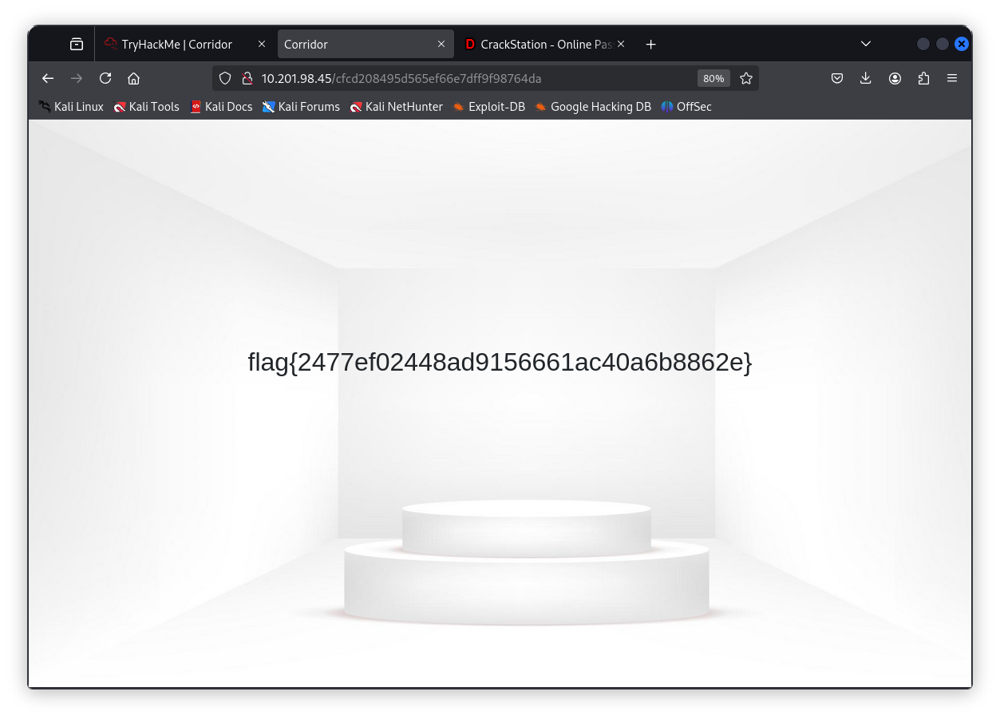

# Challenge: Corridor

## Details:

- Source: [TryHackMe](https://tryhackme.com/room/corridor)
- Category: Web Exploitation
- Difficulty: Easy
- Date Completed: 11.09.2025

## Description

You have found yourself in a strange corridor. Can you find your way back to where you came?
In this challenge, you will explore potential IDOR vulnerabilities. Examine the URL endpoints you access as you navigate the website and note the hexadecimal values you find (they look an awful lot like a hash, don't they?). This could help you uncover website locations you were not expected to access.

## Tools

- [External tool to crack hashes](https://crackstation.net/)

## Steps taken

1. The provided website was an image of a corridor.

I clicked one of the doors, and it redirected to a seemingly empty room. The url had what looked like a hash to crack which I used crackstation.

2. The cracked hash revealed a number. I then checked the source code, which had 13 different hashes linked to images. They were simply numbers from 1 to 13.

3. Now, it was time for IDOR, as the hint suggested. All I had to do was to check 0 and some more numbers after 13. I converted 0 to md5 hash in the terminal and pasted it into the URL. It revelaed the flag.

